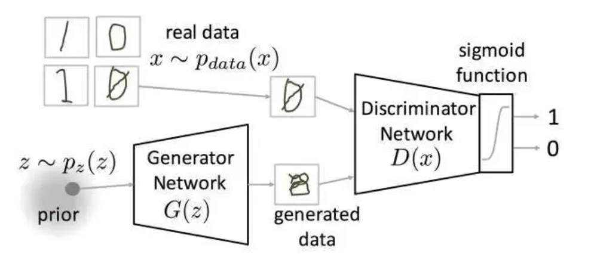
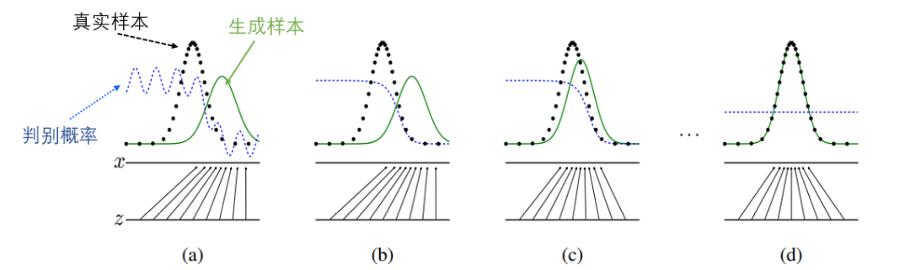
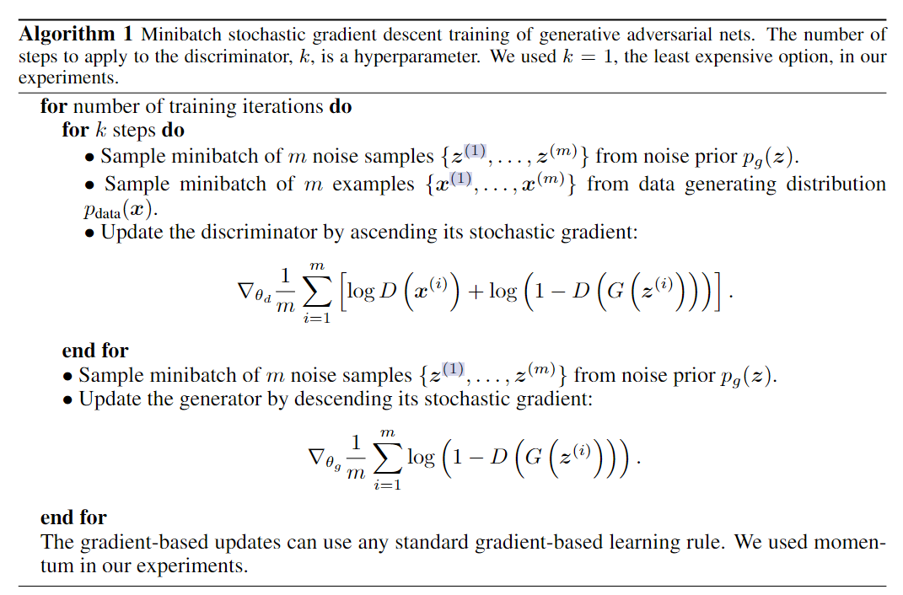

# GAN：Generative Adversarial Nets

!!! info "相关信息"
    
    
    论文地址：[Generative Adversarial Nets](https://arxiv.org/pdf/1406.2661v1)

    代码（Pytorch版）:

    资源：

    

### 概述

作者提出了一个新的framework，通过一个对抗的过程来估计一个生成模型，同时训练两个模型：一个生成模型$G$，另一个是判别模型$D$，其中生成模型$G$是通过捕获样本数据分s布来生成新的数据，判别模型$D$是用来估计样本来自训练数据而不是$G$的概率，其中生成模型训练的过程就是为了使判别模型出错的概率最大化（一个博弈的过程）。

在$G$和$D$都是由多层感知器（MLP）定义的情况下，整个系统可以通过反向传播进行训练。

### 基本原理

生成对抗网络（Generative Adversarial Network, GAN）由一个生成器和一个判别器组成。生成器从潜在空间随机取样作为输入，其输出结果需要尽量模仿训练集中的真实样本。判别器的输入则为真实样本或生成器的输出，其目的是将生成器的输出从真实样本中尽可能分别出来。生成器和判别器相互对抗、不断学习，最终目的使得判别器无法判断生成器的输出结果是否真实。

为了学习Generator在数据$x$上的分布$p_g$，我们定义一个输入噪声变量$p_z(z)$，将映射到数据空间的映射表示为$G(z;\theta_g)$，$G$为一个multilayer perceptron，$theta_g$为其参数。我们也定义第二个multilayer perceptron $D(x;\theta_d)$，其输出为标量，表示数据$x$来自真实数据的概率。

对于判别器$D$，我们通过maximize the probability of assigning the correct label to both training examples and samples from $G$的方式来训练$D$；对于生成器$G$,我们通过minimize $log(1-D(G(z)))$的方式训练。$G$与$D$同时作对抗训练。

即$D$ and $G$ play the following two-player minimax game with value function $V (G, D)$:

$$
\min_G \max_D V(D,G) = \mathbb{E}_{x\sim p_{data}(x)} [\log D(x)] + \mathbb{E}_{z\sim p_z(z)} [\log (1-D(G(z)))]
$$

在实验中，上式并不能为$G$提供足够的梯度去学习，在学习早期，因为真实样本与$G$生成的样本有着明显差别，因此$D$ reject samples with high confidence，$log(1-D(G(z)))$存在饱和现象。因此我们可以使用一下方法：Rather than training $G$ to minimize $log(1-D(G(z)))$, we can train $G$ to maximize $log(D(z))$。 

如上图所示：虚线点为真实数据分布，蓝色虚线是判别器D的分布，绿色实线为生成器G的分布。初始训练出生成器网络G和判别器网络D；从a到d是我们希望的训练过程。

对于任意给定的生成器$G$，则最优的判别器$D^*$为：

$$
D^*_G(x) = \max V(G,D) = \frac{p_{data}(x)}{p_{data}(x) + p_g(x)}
$$

其中$p_g$与$p_{data}$表示$x$在生成器$G$拟合的分布，和真实数据的分布里的概率。当$p_g=p_{data}$时，结果为$\frac{1}{2}$，表示两个分布完全相同，最优的判别器也无法分辨出来。

由上图：

$$
Loss_D = CrossEntryLoss(D(x),1) + CrossEntryLoss(D(G(z)),0)
$$

$$
Loss_G = CrossEntryLoss(D(G(z)),1)
$$

### GAN的缺点

- 难以收敛（non-convergence）。目前面临的基本问题是：所有的理论都认为 GAN 应该在纳什均衡（Nash equilibrium）上有卓越的表现，但梯度下降只有在凸函数的情况下才能保证实现纳什均衡。当博弈双方都由神经网络表示时，在没有实际达到均衡的情况下，让它们永远保持对自己策略的调整是可能的。

- 难以训练：崩溃问题（collapse problem）。GAN模型被定义为极小极大问题，没有损失函数，在训练过程中很难区分是否正在取得进展。GAN的学习过程可能发生崩溃问题（collapse problem），生成器开始退化，总是生成同样的样本点，无法继续学习。当生成模型崩溃时，判别模型也会对相似的样本点指向相似的方向，训练无法继续。

- 无需预先建模，模型过于自由不可控。与其他生成式模型相比，GAN不需要构造分布函数，而是使用一种分布直接进行采样，从而真正达到理论上可以完全逼近真实数据，这也是GAN最大的优势。然而，这种不需要预先建模的方法缺点是太过自由了，对于较大的图片，较多的pixel的情形，基于简单 GAN 的方式就不太可控了(超高维)。
                   
