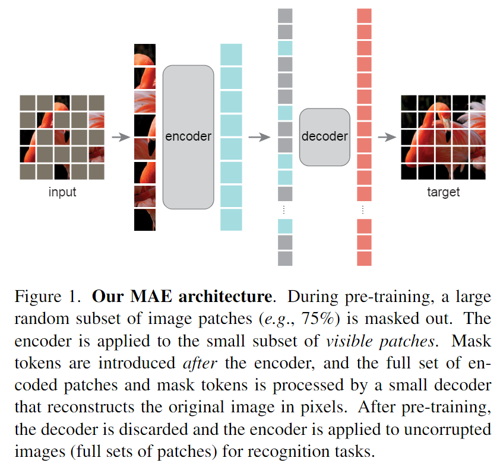
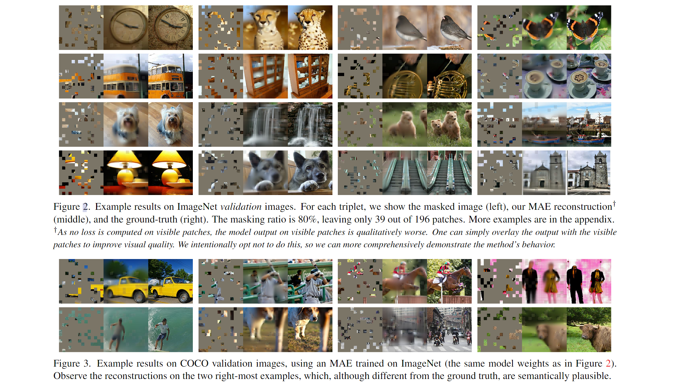
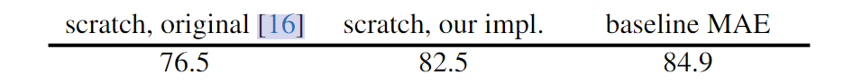
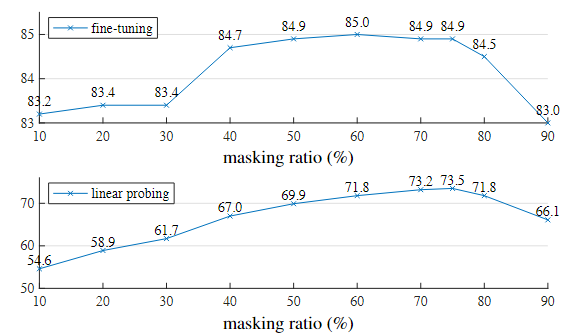
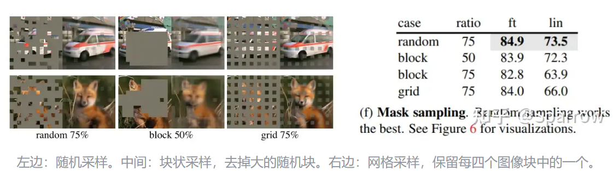
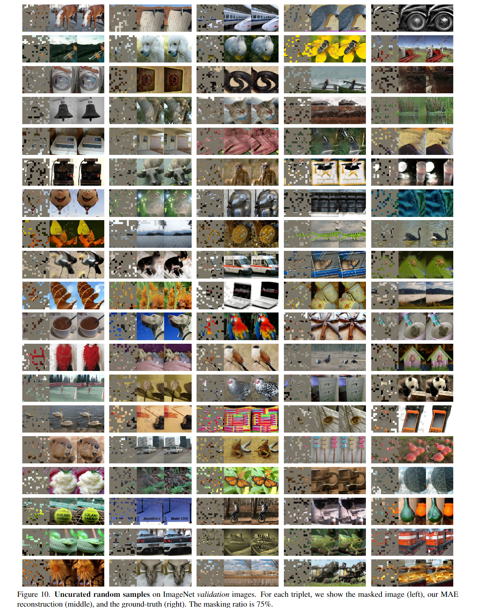

# MAE：Masked Autoencoders Are Scalable Vision Learners

<script src="https://polyfill.io/v3/polyfill.min.js?features=es6"></script>
<script src="https://cdn.jsdelivr.net/npm/mathjax@3/es5/tex-chtml.js"></script>

!!! info "相关信息"
    <font size = 3.5>
    
    论文地址：[Masked Autoencoders Are Scalable Vision Learners](https://arxiv.org/abs/2111.06377)

    代码（Pytorch版）:[https://github.com/facebookresearch/mae/](https://github.com/facebookresearch/mae/)

    资源：

    </font>

### 概述

MAE是一种简单、有效且可扩展的 用于视觉表示学习的非对称编码器-解码器体系结构，其中的编码器只对可见的patch子集（没有mask的token）进行操作，同时还有一个轻量级的解码器，该解码器从潜在表示和mask token中重建原始图像。其次，作者发现mask高比例的输入图像patch（例如75%）会变成一个不错且有意义的自监督任务。将这两种设计结合起来，能够高效地训练大型模型：本文的模型加快训练速度（3倍或更多）并提高精度。

> 我们开发了一个非对称编码器-解码器架构，其中一个编码器只对可见的patches子集进行操作（没有掩码标记），以及一个轻量级解码器，可以从潜在表示和掩码标记重建原始图像。我们发现屏蔽大部分输入图像，例如 75%，会产生重要且有意义的自监督任务。将这两种设计结合起来使我们能够高效地训练大型模型，将训练速度提高 3 倍或更多，并提高准确性。



论文在 ```ImageNet-1K``` 训练集上进行了自监督的预训练，然后进行了监督训练，以通过端到端的微调或线性探测来评估表示。他们使用```ViT-Large (ViT-L/16)```作为他们的模型并验证Top1准确性。

结果表明，MAE 学习了非常高容量的模型，这些模型也能很好地泛化。使用普通的```ViT-Huge```模型，```MAE``` 在 ```ImageNet-1K``` 上进行微调时达到了 ```87.8%``` 的准确率。



### 方法

MAE作为一种自监督学习框架，其核心思想是：给定一个完整的输入图像，随机遮挡一部分patch，然后通过未遮挡的patch来预测被遮挡的patch。并且，模型采用了一种<B>非对称设计</B>，从输入图像中随机mask部分patch，利用解码器在像素空间中<B>重构</B>丢失的patch。编码器仅仅对可见的patch进行计算。解码器是一个<B>轻量化的网络</B>，在解码器中使用mask token与编码器的输出一同重构像素，这样计算量大大减小。

- Masking

对于从patch中选取mask，作者采用了<B>机抽样</B>的方法，在对原本顺序的patch进行shuffle后选取前25%作为可见的patch，其余的75%作为mask。这样<B>高遮盖率</B>的随机采样在很大程度上消除了冗余(redundancy)，因此创建了一个无法通过从可见相邻patch来轻松解决的任务。均匀分布可防止潜在的中心偏移（即图像中心附近有更多遮盖patch）。最后，高度稀疏的输入为设计高效编码器创造了机会。

- MAE Encoder


MAE的编码器采用```ViT```结构，对可见的patch进行编码，去除了mask patch，且不使用mask token，而mask的部分，会交给更轻量级的decoder来处理。这使我们能够用一小部分的计算和内存来训练非常大的编码器。

- MAE Decoder

MAE的解码器采用一个轻量级的```Decoder```，主体包含几个```transformer blocks```，而最后一层是一个linear层，用来直接预测mask patch的像素值，其输出通道数是和一个patch像素数一致，输出经过reshape以后形成重建图像。解码器的输入信息是所有token，由编码器输出的编码向量和mask token组成。每个mask token都是一个共享的、可学习的向量，表示要预测的缺失patch。而后给所有token添加```positional embedding```

训练的loss采用重建图像和原始图像之间的的均方误差（```MSE```）：计算预测像素值和原始像素值的均方误差，不过loss只计算mask patch上的损失。

### 实验

论文使用了```ViT-Large（ViT-L/16）```作为编码器在```ImageNet-1K```实验，对比了使用MAE无监督预训练与从头训练后模型，来评估encoder的表征能力。



可知，```baseline MAE```的方法（经```MAE```预训练后```fine-tune```）的模型表现优于从头训练的模型，说明```MAE```预训练能够提升模型的表征能力。

- ```Masking ratio```



作者认为：图像是低信息密度的，其中<B>信息冗余非常大</B>，因此需要较大比例的Mask。根据实验可知，```Masking ratio```大于50%是较好的，能让模型学习到比较深刻的信息。而对于nlp任务的高信息密度的任务，BERT使用15%的mask比例已经足矣。

即信息密度越大，我们需要mask的比例越少；信息密度越稀疏，我们需要mask的比例越多。

同时，实验也证实了使用随机采样(random masking)的效果较好：



### fine-tuning

对于```ViT architecture```：

> 我们遵循标准的ViT架构。它有一堆```Transformer```块，每个块由一个多头自注意力块和MLP块组成，两者都具有```LayerNorm (LN)```。编码器以```LN```结束。由于```MAE```编码器和解码器的宽度不同，我们在编码器之后采用```linear projection layer```来匹配它。```MAE```将```positional embeddings```（the sine-cosine version）添加到编码器和解码器输入中。我们的 MAE 不使用相对位置或层缩放。我们<B>从编码器输出中提取特征进行```Fine-tuning```和```Linear Probing```</B>。由于```ViT```有一个类标记```[CLS]```，为了适应这种设计，在我们的```MAE```预训练中，我们<B>将辅助虚拟标记附加到编码器输入中</B>。该标记将被视为用于在```Linear Probing```和```Fine-tuning```中训练分类器的类标记。我们的```MAE```在没有这个标记（使用average pooling代替）的情况下也同样有效。

- Pre-training

> 我们不使用```color jittering, drop path, gradient clip```。我们使用```xavier uniform```来初始化所有```Transformer```块，遵循ViT的官方代码。我们使用线性lr缩放规则 [20]：$lr = base_lr \times batchsize / 256$。

.png)

- End-to-end fine-tuning

> 我们的微调遵循```supervised ViT```训练的常见做法，默认设置如表所示。我们使用分层lr衰减（```layer-wise lr decay```）。


.png)

- Linear probing

> 我们观察到```Linear Probing```需要与```End-to-end fine-tuning```非常不同的方案。<B>特别在于，正则化通常对```Linear Probing```有害。</B>我们禁用了许多常见的正则化策略:我们不使用```mixup、cutmix、droppath```或```color jittering```，并且我们设置权值衰减为零。

.png)

### mask修复效果展示（原文）



### 代码实现（kaiming）

<details> 
<summary>utils</summary>

```python

```

</details> 


<details> 
<summary>models_mae.py</summary>

```python
from functools import partial

import torch
import torch.nn as nn

from timm.models.vision_transformer import PatchEmbed, Block

from util.pos_embed import get_2d_sincos_pos_embed


class MaskedAutoencoderViT(nn.Module):
    """ Masked Autoencoder with VisionTransformer backbone
    """
    def __init__(self, img_size=224, patch_size=16, in_chans=3,
                 embed_dim=1024, depth=24, num_heads=16,
                 decoder_embed_dim=512, decoder_depth=8, decoder_num_heads=16,
                 mlp_ratio=4., norm_layer=nn.LayerNorm, norm_pix_loss=False):
        super().__init__()

        # --------------------------------------------------------------------------
        # MAE encoder specifics
        self.patch_embed = PatchEmbed(img_size, patch_size, in_chans, embed_dim)
        num_patches = self.patch_embed.num_patches

        self.cls_token = nn.Parameter(torch.zeros(1, 1, embed_dim))
        self.pos_embed = nn.Parameter(torch.zeros(1, num_patches + 1, embed_dim), requires_grad=False)  # fixed sin-cos embedding

        self.blocks = nn.ModuleList([
            Block(embed_dim, num_heads, mlp_ratio, qkv_bias=True, qk_scale=None, norm_layer=norm_layer)
            for i in range(depth)])
        self.norm = norm_layer(embed_dim)
        # --------------------------------------------------------------------------

        # --------------------------------------------------------------------------
        # MAE decoder specifics
        self.decoder_embed = nn.Linear(embed_dim, decoder_embed_dim, bias=True)

        self.mask_token = nn.Parameter(torch.zeros(1, 1, decoder_embed_dim))

        self.decoder_pos_embed = nn.Parameter(torch.zeros(1, num_patches + 1, decoder_embed_dim), requires_grad=False)  # fixed sin-cos embedding

        self.decoder_blocks = nn.ModuleList([
            Block(decoder_embed_dim, decoder_num_heads, mlp_ratio, qkv_bias=True, qk_scale=None, norm_layer=norm_layer)
            for i in range(decoder_depth)])

        self.decoder_norm = norm_layer(decoder_embed_dim)
        self.decoder_pred = nn.Linear(decoder_embed_dim, patch_size**2 * in_chans, bias=True) # decoder to patch
        # --------------------------------------------------------------------------

        self.norm_pix_loss = norm_pix_loss

        self.initialize_weights()

    def initialize_weights(self):
        # initialization
        # initialize (and freeze) pos_embed by sin-cos embedding
        pos_embed = get_2d_sincos_pos_embed(self.pos_embed.shape[-1], int(self.patch_embed.num_patches**.5), cls_token=True)
        self.pos_embed.data.copy_(torch.from_numpy(pos_embed).float().unsqueeze(0))

        decoder_pos_embed = get_2d_sincos_pos_embed(self.decoder_pos_embed.shape[-1], int(self.patch_embed.num_patches**.5), cls_token=True)
        self.decoder_pos_embed.data.copy_(torch.from_numpy(decoder_pos_embed).float().unsqueeze(0))

        # initialize patch_embed like nn.Linear (instead of nn.Conv2d)
        w = self.patch_embed.proj.weight.data
        torch.nn.init.xavier_uniform_(w.view([w.shape[0], -1]))

        # timm's trunc_normal_(std=.02) is effectively normal_(std=0.02) as cutoff is too big (2.)
        torch.nn.init.normal_(self.cls_token, std=.02)
        torch.nn.init.normal_(self.mask_token, std=.02)

        # initialize nn.Linear and nn.LayerNorm
        self.apply(self._init_weights)

    def _init_weights(self, m):
        if isinstance(m, nn.Linear):
            # we use xavier_uniform following official JAX ViT:
            torch.nn.init.xavier_uniform_(m.weight)
            if isinstance(m, nn.Linear) and m.bias is not None:
                nn.init.constant_(m.bias, 0)
        elif isinstance(m, nn.LayerNorm):
            nn.init.constant_(m.bias, 0)
            nn.init.constant_(m.weight, 1.0)

    def patchify(self, imgs):
        """
        imgs: (N, 3, H, W)
        x: (N, L, patch_size**2 *3)
        """
        p = self.patch_embed.patch_size[0]
        assert imgs.shape[2] == imgs.shape[3] and imgs.shape[2] % p == 0

        h = w = imgs.shape[2] // p
        x = imgs.reshape(shape=(imgs.shape[0], 3, h, p, w, p))
        x = torch.einsum('nchpwq->nhwpqc', x)
        x = x.reshape(shape=(imgs.shape[0], h * w, p**2 * 3))
        return x

    def unpatchify(self, x):
        """
        x: (N, L, patch_size**2 *3)
        imgs: (N, 3, H, W)
        """
        p = self.patch_embed.patch_size[0]
        h = w = int(x.shape[1]**.5)
        assert h * w == x.shape[1]
        
        x = x.reshape(shape=(x.shape[0], h, w, p, p, 3))
        x = torch.einsum('nhwpqc->nchpwq', x)
        imgs = x.reshape(shape=(x.shape[0], 3, h * p, h * p))
        return imgs

    def random_masking(self, x, mask_ratio):
        """
        Perform per-sample random masking by per-sample shuffling.
        Per-sample shuffling is done by argsort random noise.
        x: [N, L, D], sequence
        """
        N, L, D = x.shape  # batch, length, dim
        len_keep = int(L * (1 - mask_ratio))
        
        noise = torch.rand(N, L, device=x.device)  # noise in [0, 1]
        
        # sort noise for each sample
        ids_shuffle = torch.argsort(noise, dim=1)  # ascend: small is keep, large is remove
        ids_restore = torch.argsort(ids_shuffle, dim=1)

        # keep the first subset
        ids_keep = ids_shuffle[:, :len_keep]
        x_masked = torch.gather(x, dim=1, index=ids_keep.unsqueeze(-1).repeat(1, 1, D))

        # generate the binary mask: 0 is keep, 1 is remove
        mask = torch.ones([N, L], device=x.device)
        mask[:, :len_keep] = 0
        # unshuffle to get the binary mask
        mask = torch.gather(mask, dim=1, index=ids_restore)

        return x_masked, mask, ids_restore

    def forward_encoder(self, x, mask_ratio):
        # embed patches
        x = self.patch_embed(x)

        # add pos embed w/o cls token
        x = x + self.pos_embed[:, 1:, :]

        # masking: length -> length * mask_ratio
        x, mask, ids_restore = self.random_masking(x, mask_ratio)

        # append cls token
        cls_token = self.cls_token + self.pos_embed[:, :1, :]
        cls_tokens = cls_token.expand(x.shape[0], -1, -1)
        x = torch.cat((cls_tokens, x), dim=1)

        # apply Transformer blocks
        for blk in self.blocks:
            x = blk(x)
        x = self.norm(x)

        return x, mask, ids_restore

    def forward_decoder(self, x, ids_restore):
        # embed tokens
        x = self.decoder_embed(x)

        # append mask tokens to sequence
        mask_tokens = self.mask_token.repeat(x.shape[0], ids_restore.shape[1] + 1 - x.shape[1], 1)
        x_ = torch.cat([x[:, 1:, :], mask_tokens], dim=1)  # no cls token
        x_ = torch.gather(x_, dim=1, index=ids_restore.unsqueeze(-1).repeat(1, 1, x.shape[2]))  # unshuffle
        x = torch.cat([x[:, :1, :], x_], dim=1)  # append cls token

        # add pos embed
        x = x + self.decoder_pos_embed

        # apply Transformer blocks
        for blk in self.decoder_blocks:
            x = blk(x)
        x = self.decoder_norm(x)

        # predictor projection
        x = self.decoder_pred(x)

        # remove cls token
        x = x[:, 1:, :]

        return x

    def forward_loss(self, imgs, pred, mask):
        """
        imgs: [N, 3, H, W]
        pred: [N, L, p*p*3]
        mask: [N, L], 0 is keep, 1 is remove, 
        """
        target = self.patchify(imgs)
        if self.norm_pix_loss:
            mean = target.mean(dim=-1, keepdim=True)
            var = target.var(dim=-1, keepdim=True)
            target = (target - mean) / (var + 1.e-6)**.5

        loss = (pred - target) ** 2
        loss = loss.mean(dim=-1)  # [N, L], mean loss per patch

        loss = (loss * mask).sum() / mask.sum()  # mean loss on removed patches
        return loss

    def forward(self, imgs, mask_ratio=0.75):
        latent, mask, ids_restore = self.forward_encoder(imgs, mask_ratio)
        pred = self.forward_decoder(latent, ids_restore)  # [N, L, p*p*3]
        loss = self.forward_loss(imgs, pred, mask)
        return loss, pred, mask


def mae_vit_base_patch16_dec512d8b(**kwargs):
    model = MaskedAutoencoderViT(
        patch_size=16, embed_dim=768, depth=12, num_heads=12,
        decoder_embed_dim=512, decoder_depth=8, decoder_num_heads=16,
        mlp_ratio=4, norm_layer=partial(nn.LayerNorm, eps=1e-6), **kwargs)
    return model


def mae_vit_large_patch16_dec512d8b(**kwargs):
    model = MaskedAutoencoderViT(
        patch_size=16, embed_dim=1024, depth=24, num_heads=16,
        decoder_embed_dim=512, decoder_depth=8, decoder_num_heads=16,
        mlp_ratio=4, norm_layer=partial(nn.LayerNorm, eps=1e-6), **kwargs)
    return model


def mae_vit_huge_patch14_dec512d8b(**kwargs):
    model = MaskedAutoencoderViT(
        patch_size=14, embed_dim=1280, depth=32, num_heads=16,
        decoder_embed_dim=512, decoder_depth=8, decoder_num_heads=16,
        mlp_ratio=4, norm_layer=partial(nn.LayerNorm, eps=1e-6), **kwargs)
    return model
```

</details> 