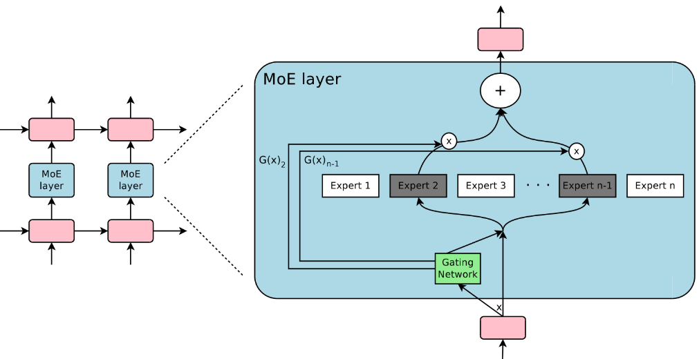

# Outrageously Large Neural Networks: The Sparsely-Gated Mixture-of-Experts Layer

<script src="https://polyfill.io/v3/polyfill.min.js?features=es6"></script>
<script src="https://cdn.jsdelivr.net/npm/mathjax@3/es5/tex-chtml.js"></script>

!!! info "相关信息"
    <font size = 3.5>
    
    论文地址：[Outrageously Large Neural Networks: The Sparsely-Gated Mixture-of-Experts Layer](https://arxiv.org/abs/1701.06538)

    代码（Pytorch版）:[https://github.com/davidmrau/mixture-of-experts](https://github.com/davidmrau/mixture-of-experts/blob/master/moe.py)

    参考学习：[【论文精炼】OUTRAGEOUSLY LARGE NEURAL NETWORKS: THE SPARSELY-GATED MIXTURE-OF-EXPERTS LAYER | 超大规模神经网络：稀疏门控专家混合层](https://www.cnblogs.com/noluye/p/14597977.html)

    </font>


### 概述

神经网络的吸收信息的容量（The capacity of a neural network to absorb information）受限于参数数目。

条件计算（conditional computation）<B>针对于每个样本，激活网络的部分子网络进行计算</B>，它在理论上已证明，可以作为一种<B>显著增加模型容量的方法</B>。

在实际中，我们在牺牲少量计算效率的情况下，实现了 1000 倍的模型容量（model capacity）的提升。

我们引入了<B>稀疏门控专家混合层（Sparsely-Gated Mixture-of-Experts Layer），包括数以千计的前馈子网络</B>。对于每一个样本，有一个可训练的门控网络（gating network）会计算这些专家（指前馈子网络）的稀疏组合。在我们提出的模型架构里，MoE 包含 1370 亿个参数，以卷积的方式放在堆叠 LSTM 层之间。我们把专家混合（MoE）应用于语言建模和机器翻译任务中，对于这些任务，从训练语料库中吸收的巨量知识，是十分关键的。

在大型语言建模和及其翻译的基准测试中，该模型<B>以更少的计算成本，实现了比最先进方法更好的结果。</B>

### 方法

本文的条件计算方法，就是引入了一个新的通用神经网络组件类型：稀疏门控专家混合层（```MoE```）：

```MoE```由许多专家(experts)(每个专家都是一个简单的前馈神经网络)，以及一个可训练的门控网络组成，（门控网络可以选择专家的稀疏组合来处理每个输入）。



本文聚焦在语言建模和机器翻译任务中，我们把```MoE```以卷积的方式放在多层```LSTM```层之间。在文本的每个位置上，就会调用```MoE```一次，进而<B>可能选择不同的专家组合</B>。不同的专家会倾向于变得高度专业化（基于语法和语义）。

一个标准的```MoE```层包括：

- 多位专家（experts）:$E_1, E_2,... ,E_n$

- 一个门控网络$G$，其输出是一个稀疏的n维向量

因此```MoE```层的输出为：

$$
\hat{y} = \sum_{i=1}^{n} G_i(x) E_i(x)
$$

其中$G(x)$是门控网络的输出，$E_i(x)$是第i个专家的输出。

由于$G(x)$具有稀疏性，因此可以大大节省计算量（即当$G_i(x)=0$时，对应的$E_i(x)$不需要计算）

### 门控网络$G$

$$
G(x) = \text{Softmax}(x \text{W}_G)
$$

为了确保输出的稀疏性，我们选择保留top-k的值。我们也加入了可调的高斯噪声，为了帮助<B>负载均衡（load balancing）</B>

即：

$$
G(x)=\operatorname{Softmax}(\operatorname{KeepTopK}(H(x), k))
$$

$$ 
H(x)_{i}=\left(x \cdot W_{g}\right)_{i}+\text { StandardNormal }() \cdot \operatorname{Softplus}\left(\left(x \cdot W_{\text {noise }}\right)_{i}\right)
$$

### 平衡专家的利用率(BALANCING EXPERT UTILIZATION)

我们观察到，门控网络倾向于收敛到一种不好的状态，<B>即对少量专家，总是会得到较大的权重</B>。这种不平衡是不断自我强化（self-reinforcing）的，随着更好的专家不断训练学习，它们更有可能被门控网络选中。面对这种问题，过去文献有的用硬性约束，有的用软性约束。

我们采用<B>软性约束方法</B>。我们定义<B>对于一个批次训练样本的专家重要度（the importance of an expert）</B>，即该专家<B>在一个批次上的门控输出值的和<B>。并且定义损失项$L_{importance}$，加入到模型的<B>总损失</B>上。<B>该损失项等于所有专家重要度的方差的平方，再加上一个手工调节的比例因子$w_{importance}$<B>。这个损失项会鼓励所有专家有相同的重要度。

$$
Importance(X) = \sum_{x \in X} G(x)
$$

$$
L_{importance}(X) = w_{importance} \cdot CV(Importance(X))^2
$$

尽管现在的损失函数可以保证相同的重要度，专家仍然可能接收到差异很大的样本数目。例如，某些专家可能接收到少量的大权重的样本；而某些专家可能接收到更多的小权重的样本。为了解决这个问题，我们引入了第二个损失函数：$L_{load}$，它可以保证负载均衡。

### 负载平衡$L_{load}$

出于负载平衡的目的，我们希望定义一个额外的损失函数来鼓励专家接收大致相同数量的训练示例。不幸的是，专家接收到的<B>示例数量是一个离散的数量，因此它不能用于反向传播。</B>

因此，我们为一批$X$的输入定义了分配给每个专家的示例数量的平滑估计器$Load(X)$，平滑度（smoothness）允许我们通过估计器反向传播梯度。

将$P(x,i)$定义为$G_i(x)$非零（the probability of nonzero）的概率，并且在元素i上加入随机噪声选择，但将已经采样的噪声选择保持在其他元素上。$G_i(x)$非零当且仅当$H_i(x)$大于$H(x)$的第k大的元素（不包括自身），即为：

$$
P(x,i) = Pr((xW_g)_i + StandardNormal() \cdot Softplus((xW_{noise})_i) 
$$
$$
> kth \_ excluding(H(x),k,i))
$$
其中$kth \_ excluding(H(x),k,i)$表示$H(x)$的第k大的元素（不包括i），简化得：

$$
P(x,i) = \Phi (\frac{ (xW_g)_i - kth \_ excluding(H(x),k,i)) }{Softplus((xW_{noise})_i)})
$$

$$
Load(x)_i = \sum_{x \in X} P(x,i)
$$

将负载损失定义为负载向量变异系数的平方，乘以手动调整的比例因子 $w_{load}$。

$$
L_{load}(X) = w_{load} \cdot CV(Load(X))^2
$$

### 分层混合专家（HIERACHICAL MIXTURE OF EXPERTS）

当专家数量较大时，可以通过分层MoE来计算：在分层MoE中，主门控网络选择“专家”的稀疏加权组合，每个组合本身就是一个具有自己门控网络的二次专家混合。我们用$G_{primary}$代表主门控网络，用($G_1,G_2,...,G_a$)代表二次门控网络，以及对应的专家网络($E_{0,0},E_{0,1},...,E_{a,b}$):

$$
y_H = \sum_{i=1}^{a} \sum_{j=1}^{b} G_{primary}(x)_i  G_i(x)_j E_{i,j}(x)
$$

专家利用指标(metrics of expert utilization)更改为以下内容：

$$
Importance_H(X)_{i,j} = \sum_{x \in X} G_{primary}(x)_i \cdot G_i(x)_j
$$

$$
Load_H(X)_{i,j} = \frac{Load_{primary}(x)_i \cdot Load_i(X^{(i)})_j}{|X^{(i)}|}
$$


