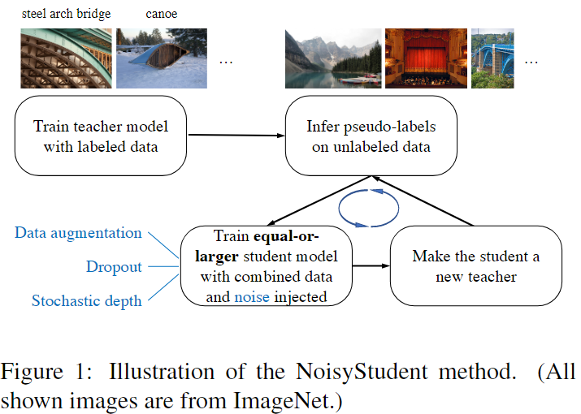
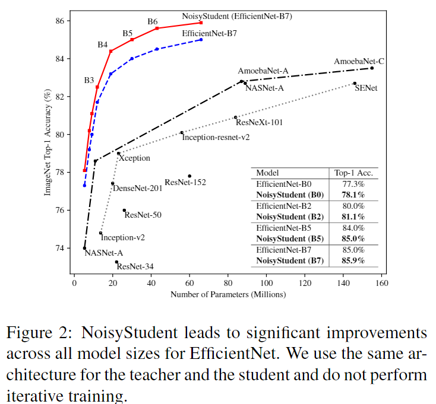
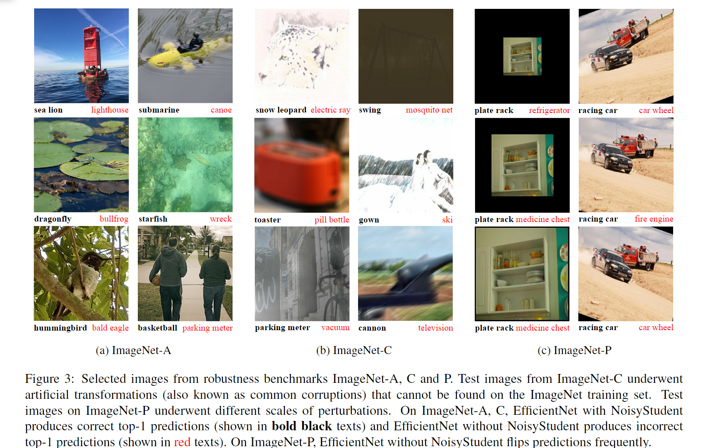

# Self-training with Noisy Student improves ImageNet classification

<script src="https://polyfill.io/v3/polyfill.min.js?features=es6"></script>
<script src="https://cdn.jsdelivr.net/npm/mathjax@3/es5/tex-chtml.js"></script>

!!! info "相关信息"
    <font size = 3.5>
    
    论文地址：[Self-training with Noisy Student improves ImageNet classification](https://arxiv.org/abs/1911.04252v4)

    代码（tensorflow版）:[https://github.com/google-research/noisystudent](https://github.com/google-research/noisystudent)

    资源：

    </font>

### 概述

```Noisy student```是一种训练策略，主要基于现有的预训练模型（教师模型）生成噪声数据，然后用这些数据去训练一个更强大的学生模型，适用于各种需要大量标注数据的深度学习任务。这种方法的独特之处在于它打破了传统的监督学习框架，允许模型在大量无标签数据中进行自我学习，从而提高泛化性能。

### 方法

在该框架下，我们准备标签与未标签的图像，并使用标签图像来训练教师模型，然后使用教师模型对未标签图像生成伪标签（soft or hard）,再使用所有的图像来训练学生模型。最后通过将学生作为教师来迭代该过程以生成新的伪标签并训练新学生。

假设已标签图像$\{ {(x_1,y_1),(x_2,y_2),...,(x_n,y_n)}  \}$，未标签图像$ \{ \tilde{x_{1}},\tilde{x_{2}},...\tilde{x_{m}} \}$。

- 训练教师模型，使标记图像的交叉熵损失最小化

$$
\frac{1}{n} \sum_{i=1}^{n} \mathbf{L} (y_i, f^{noised}(x_i, \theta^{teacher}))
$$

- 使用无噪声的教师模型为未标记的图像生成soft or hard的伪标签

$$
\tilde{y_i} = f(\tilde{x_i}, \theta^{teacher}_*), \quad ∀i = 1,2,...,m
$$

- 训练更大（equal-or-larger）的学生模型$\theta^{student}_*$，使标记图像和未标记图像的交叉熵损失最小化，噪声被添加到学生模型中。

$$
\frac{1}{n} \sum_{i=1}^{n} \mathbf{L} (y_i, f^{noised}(x_i, \theta^{student})) + \frac{1}{m} \sum_{i=1}^{n} \mathbf{L} (\tilde{y_i}, f^{noised}(\tilde{x_i}, \theta^{student}))
$$

- 迭代训练



显然```Noisy student```是一种自我训练的半监督(semi-supervised)学习方法，它通过在未标注数据上生成伪标签，来增强模型的泛化能力，从而在有限标注数据的情况下实现更好的性能。这种方法不同于```Knowledge Distillation```，其中添加噪声不是核心问题，而小模型经常被用作学生比老师更快。人们可以将我们的方法视为知识扩展，我们希望学生在噪声方面赋予学生模型更多的容量和困难的环境来学习，从而比老师更好。

- ```Noising Student```

在实验中，我们添加了两种噪音：输入噪声和模型噪声（input noise and model noise）。对于输入噪音，使用```RandAugment```的数据增强方法；对于模型噪音，我们使用 ```dropout``` 与 ```stochastic depth```（随机深度）。

```Noisy Student```通过一个额外的技巧使得效果更好：数据过滤和平衡(data filtering and balancing)，即通过滤去置信度较低的图像，因为这些图像通常是域外数据(out-of-domain)，为了确保未标记图像的分布与训练集的分布相匹配，我们还需要平衡每个类的未标记图像的数量。对于我们有太多图像的类，我们取置信度最高的图像。

作者在文中说明教师模型生成的伪标签可以是soft或hard的，因为实验观察到soft和hard对于模型结果都很有效，其中soft对于域外未标记数据（out of domain unlabeled data）的工作稍好）

### 实验

文章将```Noisy student```与当时的SOTA比较了在```ImageNet```上的结果。最后，展示了模型在<B>鲁棒性数据集（ImageNet-A、C、P）以及对抗性攻击方面的惊人改进</B>。

在模型架构上使用了当时先进的```EfficientNets```作为baseline，并且进一步扩大了```EfficientNetB7```，并获得了```EfficientNet-L2```。```EfficientNet-L2```比```EfficientNet-B7```更广泛和更深，但使用了较低的分辨率，这使得它有更多的参数来拟合大量的未标记图像。由于模型尺寸较大，```EfficientNet-L2```的训练时间大约是```EfficientNet-B7```训练时间的五倍。



在ImageNet-A、C、P上的实验发现，在并没有刻意针对鲁棒性进行优化的情况下，```Noisy Student```取得了显著的效果，这表明即使没有直接优化鲁棒性，```Noisy student```也能大大提高鲁棒性。



在教师-学生框架的典型自我训练（self-training with the teacher-student framework）中，默认情况下不使用对学生进行噪声注入，或者噪声的作用尚未完全了解或证明。我们的工作与之前的工作和先前工作的主要区别在于，我们<B>确定了噪声的重要性，并积极地注入噪声以使学生更好</B>。

```Knowledge Distillation```的主要用途是通过使学生模型更小来进行<B>模型压缩<B>。我们的方法和```Knowledge Distillation```的主要区别在于```Knowledge Distillation```没有考虑未标记的数据，且```Noisy Student```的目标不是改进学生模型，而是通过两个模型基于teacher-student的框架交换迭代来提高模型性能。


### 总结

NoisyStudent是深度学习领域的一种创新尝试，它以自我监督的方式挖掘未标注数据的价值，提供了在大数据时代提升模型性能的新途径。