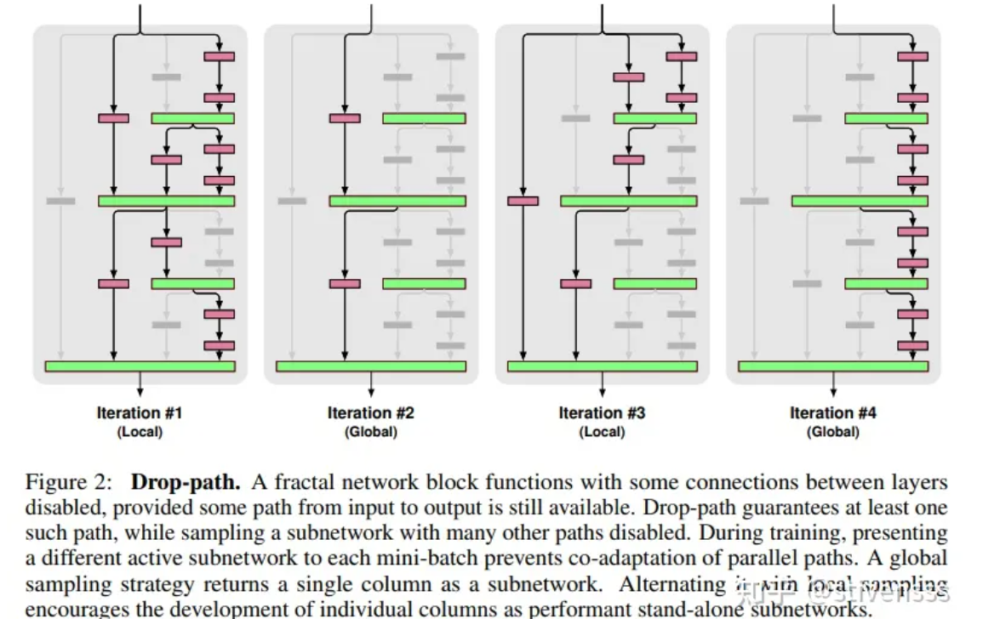
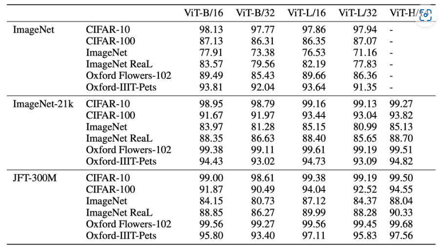

# ViT：An Image is Worth 16x16 Words: Transformers for Image Recognition at Scale

<script src="https://polyfill.io/v3/polyfill.min.js?features=es6"></script>
<script src="https://cdn.jsdelivr.net/npm/mathjax@3/es5/tex-chtml.js"></script>

!!! info "相关信息"
    <font size = 3.5>
    
    论文地址：[An Image is Worth 16x16 Words: Transformers for Image Recognition at Scale](https://arxiv.org/pdf/2010.11929v2)

    代码（Pytorch版）:[https://github.com/huggingface/pytorch-image-models/](https://github.com/huggingface/pytorch-image-models/blob/main/timm/models/vision_transformer.py)

    Labml.ai注释实现：[https://nn.labml.ai/zh/transformers/vit/index.html](https://nn.labml.ai/zh/transformers/vit/index.html)

    https://github.com/yangyunfeng-cyber/Useful-DL-Projects-for-Exercise/blob/main/VIT/vit_model.py

    </font>


!!! abstract "文章摘要"
    <font size = 3.5>

    ```ViT```是2020年Google团队提出的将```Transformer```应用在图像分类的模型，虽然不是第一篇将```transformer```应用在视觉任务的论文，但是因为其模型“简单”且效果好，可扩展性强（scalable，模型越大效果越好），基于```Transformer```的模型在视觉领域的开篇之作。ViT模型是基于```Transformer Encoder```模型的。

    相关技术：
    
    [Big Transfer (BiT): General Visual Representation Learning](https://arxiv.org/abs/1912.11370)

    [Self-training with Noisy Student improves ImageNet classification](https://arxiv.org/abs/1911.04252)

    </font>


### ViT 架构

该算法在中等规模（例如```ImageNet```）以及大规模（例如```ImageNet-21K```、```JFT-300M```）数据集上进行了实验验证，发现：

- ```Tranformer```相较于```CNN```结构，缺少一定的平移不变性Translation Equivariance和局部感知性Locality(归纳偏置Inductive Bias)，因此在数据量不充分时，很难达到同等的效果。具体表现为使用中等规模的ImageNet训练的```Tranformer```会比```ResNet```在精度上低几个百分点。

- 当有大量的训练样本时，结果则会发生改变。使用大规模数据集进行预训练后，再使用迁移学习的方式应用到其他数据集上，可以达到或超越当前的SOTA水平。


因为```Tranformer```本身并不能输入二维的图像数据，因此先将图像划分为```patches```，即输入图像$\mathbf{x} \in \mathbb{R}^{H \times W \times C}$被划分为大小为$P \times P$的```patch```，形成长度为$N=\frac{HW}{P^2}$个图像块的序列，每个```patch```表示为$\mathbf{x}_p^i \in \mathbb{R}^{1 \times (P^2 \times C)} ,i \in \{1,...,N \}$。 

为了输入进```Tranformer```，将每个```patch```拉平为一维向量，再通过一个线性层进行映射为$\mathbf{E} = \mathbb{R}^{(P^2 \times C) \times D}$，映射为一个维度为D的一维向量。

在所有```patch```之前，生成一个可学习的```[Class] Token```(一个随机的一维向量)，将其添加到图像块投影序列的前面，该```class token```在训练过程中会不断更新，用于表示整个图像的信息。

同时，为了反应每个图像块的位置信息，给每个图像块嵌入添加一个可学习的位置编码。因此共有N+1个序列，所以可学习位置编码表示为$\mathbf{E}_{pos} = \mathbb{R}^{(N+1) \times D}$。

$$
\mathbf{z}_0 = [\mathbf{x}_{class}; \mathbf{x}_p^1 \mathbf{E}; \mathbf{x}_p^2 \mathbf{E}; \cdots; \mathbf{x}_p^N \mathbf{E}] + \mathbf{E}_{pos} 
$$

$$
\mathbf{z}'_{l} = MSA(LN(\mathbf{z}_{l-1})) + \mathbf{z}_{l-1} 
$$

$$
\mathbf{z}_{l} = MLP(LN(\mathbf{z}'_{l})) + \mathbf{z}'_{l} 
$$

$$
\mathbf{y} = LN(\mathbf{z}_L^0)
$$


### ViT 模型结构

<details> 
<summary>ViT框架简洁实现（lucidrains）</summary>

```python
import torch
from torch import nn

from einops import rearrange, repeat
from einops.layers.torch import Rearrange

# helpers

def pair(t):
    return t if isinstance(t, tuple) else (t, t)

# classes

class FeedForward(nn.Module): 
    def __init__(self, dim, hidden_dim, dropout = 0.):
        super().__init__()
        self.ffnet = nn.Sequential(
            nn.LayerNorm(dim),
            nn.Linear(dim, hidden_dim),
            nn.GELU(), # GELU改进了ReLU在x=0处不可导，函数曲线不平滑的缺点
            nn.Dropout(dropout),
            nn.Linear(hidden_dim, dim),
            nn.Dropout(dropout)
        )

    def forward(self, x):
        return self.ffnet(x)

class Attention(nn.Module):
    def __init__(self, dim, heads = 8, dim_head = 64, dropout = 0.):
        super().__init__()
        '''
        dim：输入和输出的特征维度
        heads：多头注意力的头数
        dim_head：每个头的维度
        '''
        
        inner_dim = dim_head *  heads
        project_out = not (heads == 1 and dim_head == dim)
 
        self.heads = heads
        self.scale = dim_head ** -0.5

        self.norm = nn.LayerNorm(dim)

        self.attend = nn.Softmax(dim = -1)
        self.dropout = nn.Dropout(dropout)

        self.to_qkv = nn.Linear(dim, inner_dim * 3, bias = False)

        self.to_out = nn.Sequential(nn.Linear(inner_dim, dim),
                                    nn.Dropout(dropout)
        ) if project_out else nn.Identity()

    def forward(self, x):
        x = self.norm(x)

        qkv = self.to_qkv(x).chunk(3, dim = -1)
        q, k, v = map(lambda t: rearrange(t, 'b n (h d) -> b h n d', h = self.heads), qkv)

        dots = torch.matmul(q, k.transpose(-1, -2)) * self.scale

        attn = self.attend(dots)
        attn = self.dropout(attn)

        out = torch.matmul(attn, v)
        out = rearrange(out, 'b h n d -> b n (h d)')
        return self.to_out(out)

class Transformer(nn.Module):
    def __init__(self, dim, depth, heads, dim_head, mlp_dim, dropout = 0.):
        super().__init__()
        self.norm = nn.LayerNorm(dim)
        self.layers = nn.ModuleList([])
        for _ in range(depth):
            self.layers.append(nn.ModuleList([
                Attention(dim, heads = heads, dim_head = dim_head, dropout = dropout),
                FeedForward(dim, mlp_dim, dropout = dropout)
            ]))

    def forward(self, x):
        for attn, ff in self.layers:
            x = attn(x) + x
            x = ff(x) + x

        return self.norm(x)

class ViT(nn.Module):
    def __init__(self, *, image_size, patch_size, num_classes, dim, depth, heads, mlp_dim, pool = 'cls', channels = 3, dim_head = 64, dropout = 0., emb_dropout = 0.):
        super().__init__()
        
        image_height, image_width = pair(image_size)
        patch_height, patch_width = pair(patch_size)

        # 图像尺寸被块尺寸整除
        assert image_height % patch_height == 0 and image_width % patch_width == 0, 'Image dimensions must be divisible by the patch size.'

        # patch数量
        num_patches = (image_height // patch_height) * (image_width // patch_width)
        
        # patch嵌入维度
        patch_dim = channels * patch_height * patch_width
        
        assert pool in {'cls', 'mean'}, 'pool type must be either cls (cls token) or mean (mean pooling)' # ViT的两种输出模式：token[class] or average pooling

        self.to_patch_embedding = nn.Sequential(
            Rearrange('b c (h p1) (w p2) -> b (h w) (p1 p2 c)', p1 = patch_height, p2 = patch_width), # 重新排列图像数据以形成patch（einops库）
            nn.LayerNorm(patch_dim),
            nn.Linear(patch_dim, dim),
            nn.LayerNorm(dim),
        )

        self.pos_embedding = nn.Parameter(torch.randn(1, num_patches + 1, dim))
        self.cls_token = nn.Parameter(torch.randn(1, 1, dim))
        self.dropout = nn.Dropout(emb_dropout)

        self.transformer = Transformer(dim, depth, heads, dim_head, mlp_dim, dropout)

        self.pool = pool
        self.to_latent = nn.Identity()

        self.mlp_head = nn.Linear(dim, num_classes)

    def forward(self, img):
        x = self.to_patch_embedding(img)
        b, n, _ = x.shape

        cls_tokens = repeat(self.cls_token, '1 1 d -> b 1 d', b = b)
        x = torch.cat((cls_tokens, x), dim=1)
        x += self.pos_embedding[:, :(n + 1)]
        x = self.dropout(x)

        x = self.transformer(x)

        x = x.mean(dim = 1) if self.pool == 'mean' else x[:, 0]

        x = self.to_latent(x)
        return self.mlp_head(x)
```

</details>


### DropPath替代Dropout

可以采用```DropPath（Stochastic Depth）```来代替传统的```Dropout```结构。DropPath是一种针对分支网络而提出的网络正则化方法，其作用是在训练过程中随机丢弃子图层（randomly drop a subset of layers），而在预测时正常使用完整的 Graph.。其中作者提出了两种```DropPath```方法：

- Local Drop：对join层的输入分支按一定的概率进行丢弃，但是至少保证要有一个输入

- Global Drop：整个网络来只选择一条路径，且限制为某个单独列，该路径具有独立的强预测。



可以使用```from timm.layers import DropPath```来调用

### 实验

```ViT```论文中的预训练和微调实验主要采用了传统范式：首先在大规模数据集上进行监督预训练，然后在下游任务上进行监督微调。相比之下，它并没有像 BERT 一样设计出创新的<B>自监督预训练方式</B>。然而，后续肯定可以使用自监督预训练技术来进一步改进```ViT```模型。

