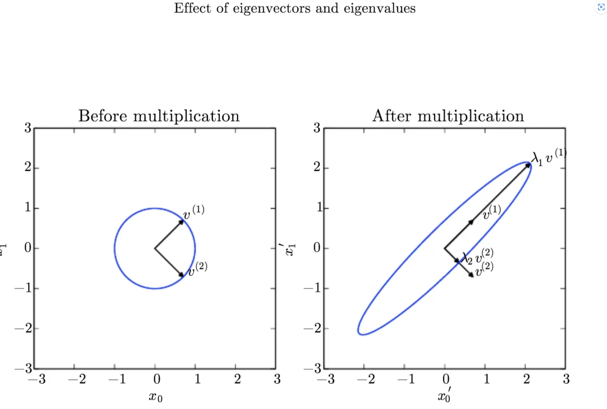
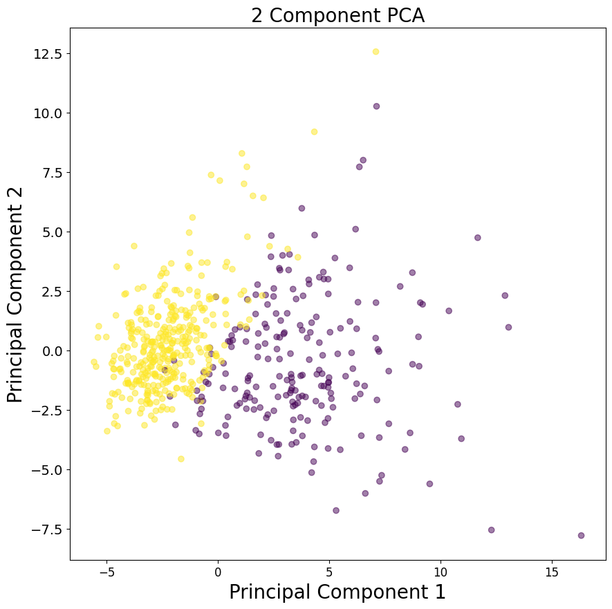
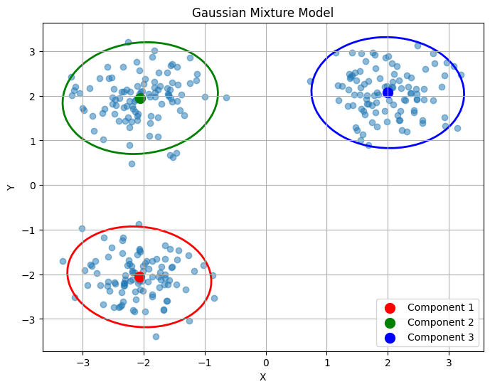

# 🛠 《DEEP LEARNING》阅读笔记

<script src="https://polyfill.io/v3/polyfill.min.js?features=es6"></script>
<script src="https://cdn.jsdelivr.net/npm/mathjax@3/es5/tex-chtml.js"></script>

!!! info "相关信息"
    <font size =4>
    正好ZJUAI协会有组队学AI的活动,面向我这种理论基础比较薄弱的同学,而且我从大一下开始学DL一直处于一个人闭门造车的阶段,找不到水平相近的人交流,所以毫不犹豫参加了组队学习的活动🤗（最新消息：已坑）
    
    - 书籍:《DEEP LEARNING》
    
    - 作者：[Ian Goodfellow](https://scholar.google.com/citations?user=iYN86KEAAAAJ&hl=zh-CN&oi=ao), [Yoshua Bengio](https://scholar.google.com/citations?hl=zh-CN&user=kukA0LcAAAAJ), [Aaron Courville](https://scholar.google.com/citations?hl=zh-CN&user=km6CP8cAAAAJ)
    - 电子书链接：https://www.deeplearningbook.org/
    </font>


## Part I: Applied Math and Machine Learning Basics

### Lecture 1: Linear Algebra
---

- 张量(tensor): 当一个数组的元素分布在若干维度坐标的规则网络中,称之为张量,可记作$\mathit{A_{i,j,k}}$

<B>转置</B>(transpose):以对角线为轴对矩阵进行镜像: $\mathit{(A^{\mathsf{T}})_{i,j}} = \mathit{A_{j,i}}$

```python
import torch

ExmapleTensor = torch.randn(2,3)
TransposedTensor = torch.transpose(ExmapleTensor) 
# torch.transpose(ExmapleTensor, 0, 1) 将第0维和第1维进行交换
```

!!! note "<B>广播机制</B>"
    <font size = 4>
    在深度学习中,当矩阵运算形状不匹配时,允许在执行元素级操作时自动扩展数组的维度(<B>一般用于矩阵与单个向量之间的运算</B>)Broadcasting机制使用的前提是两个参与运算的张量是可broadcastable的

    <B>Broadcastable</B>
    
    - 每个tensor至少是一维的

    - 两个tensor的维数从后往前对应，对应位置要么是相等的，要么其中一个是1，或者不存在
    
    常用示例:
    ```python
    import torch

    BroadcastingTensor_1 = torch.tensor([1, 2, 3]) + torch.tensor([2])  
    #: tensor([3, 4, 5])
    
    BroadcastingTensor_2 = torch.tensor([[1, 2], [3, 4]]) + torch.tensor([1, 2]) 
    #: tensor([[2, 4],
    #          [4, 6]])
    
    BroadcastingTensor_3 = torch.tensor([[1, 2], [3, 4]]) + torch.tensor([[1], [2]]) 
    #: tensor([[2, 3],
    #          [5, 6]])

    BroadcastingTensor_multiply = torch.tensor([[1, 2], [3, 4]]) * torch.tensor([1, 2])
    #: tensor([[1, 4],
    #          [3, 8]])
    ```
    </font>

<B>矩阵乘法</B>:
---

在进行矩阵乘法(matrix multiplication)时,矩阵$\mathit{A}$的行数与矩阵$\mathit{B}$的行数相等:

\[
    \mathit{C_{m \times p}} = \mathit{A_{m \times n}} \mathit{B_{n \times p}}
\]

!!! note "Hadamard乘积"
    <font size = 3.5>
    Hadamard乘积（矩阵逐元素乘积）是指两个形状相同的张量之间的元素对应相乘的操作。这种操作在深度学习中经常用于实现多种功能(特征融合),记为:
    
    \[
        \mathit{C} = \mathit{A} \odot \mathit{B}    
    \]
    
    
    ```python
        Tensor1 = torch.tensor([[1, 2],[3, 4]])
        Tensor2 = torch.tensor([[3, 4],[6, 2]])
        result = torch.mul(Tensor1, Tensor2)
        #:tensor([[ 3,  8],
        #         [18,  8]])
    ```
    </font>

<B>单位矩阵$I_n$</B>:
---

单位矩阵(identity matrix)所有沿着主对角线的元素都是1,而其他元素均为0

\[
    I_n=
    \begin{eqnarray}
    \begin{pmatrix}
        1 & \cdots & 0 \\
        \vdots & \ddots & \vdots
        \\0 & \cdots & 1
    \end{pmatrix}
    \end{eqnarray}
\]

对于单位矩阵$I_n$,任意向量与$I_n$相乘不会变化, 形式上: $I_n \in \mathbb{R}^{n \times n} , \forall x \in \mathbb{R}^{n}, I_n x = x$  

```python
IdentityTensor = torch.eye(3)
#: tensor([[1., 0., 0.],
#          [0., 1., 0.],
#          [0., 0., 1.]])
```

<B>矩阵逆(matrix inversion)</B>:矩阵$\mathit{A}$的矩阵逆记作$\mathit{A^{-1}}$,有:

\[
    \mathit{A} \mathit{A^{-1}} = I_n
\]

```python
A = torch.tensor([[1., 2., 3.], [1.5, 2., 2.3], [.1, .2, .5]])
A_inv = torch.linalg.inv(A) 
# torch.linalg.inv()有当张量是方阵且有非零行列式时，才能计算逆
print("逆矩阵:", A_inv)
#: 逆矩阵: tensor([[ -2.7000,   2.0000,   7.0000],
#                 [  2.6000,  -1.0000, -11.0000],
#                 [ -0.5000,   0.0000,   5.0000]])

>>> B = torch.tensor([[1., 2.], [3., 4.]])      # 输入一个不可逆矩阵,会报错
>>> torch.linalg.inv(B)
_LinAlgError: linalg.inv: The diagonal element 2 is zero, the inversion could not be completed because the input matrix is singular.
>>> B_int = torch.tensor([[1, 2], [3, 4]], dtype=torch.int64) # 输入矩阵的元素类型不支持
>>> torch.linalg.inv(a)
RuntimeError: Input tensor must be a floating point or complex tensor.
```


<B>范数</B>:
---
在深度学习中我们经常用$L^p$范数来衡量一个向量的大小,记作:

\[
    \lVert x \Vert_p =  ( \sum_{i=1}^n |x_i|^p )^{\frac{1}{p}}    
\]

- <B>$L^1$范数</B>(曼哈顿距离): 向量元素绝对值的总和,在零与非零元素之间的差异非常重要时使用$L^1$范数

\[
    \lVert x \Vert_1 =   \sum_{i} |x_i|     
\]

- <B>$L^2$范数</B>(欧几里得范数): 表示从远点出发到向量$x$确定的点的欧几里得距离,是最常用的范数类型

\[
    \lVert x \Vert_2 =  \sqrt{ \sum_{i} |x_i|^2 }     
\]

- <B>$L^∞$无穷范数</B>:无穷范数是向量中所有元素绝对值的最大值,度量了向量中的最大元素，对异常值非常敏感.

\[
    \lVert x \Vert_∞ = \mathop{max}\limits_{i} (|x_i|)       
\]

- <B>$Frobenius$范数</B>:矩阵元素平方和的平方根,度量了矩阵的整体“能量”，适用于矩阵而非向量。(类似用于矩阵的$L^2$范数)

\[
    \lVert A \Vert_F =  \sqrt{ \sum_{i,j} A_{i,j}^2 }     
\]

<B>正交矩阵</B>
---
若存在向量$x$与$y$,满足$x^T y = 0$,则向量$x$与$y$相互正交(orthogonal).正交矩阵是一个方阵，它的行向量和列向量都是<B>标准正交的</B>，即它们的内积为零，而每个向量的范数为一($\lVert x \Vert_2 = 1$)。具体来说，如果矩阵 \( Q \) 是一个 \( n \times n \) 的正交矩阵，那么它满足以下条件：

\[ Q^TQ = QQ^T = I_n \]

由此可得:

- **逆矩阵**：正交矩阵的逆矩阵就是它的转置，即\( Q^{-1} = Q^T \)。

- **行列式**：正交矩阵的行列式的绝对值为 1，即 \( |\det(Q)| = 1 \)。


<B>特征分解</B>
---

对于一个给定的方阵 \( A \)，如果存在一个非零向量 \( v \) 和一个标量 \( \lambda \)，使得下面的等式成立：

\[ A \cdot v = \lambda \cdot v \]

那么 \( \lambda \) 被称为矩阵 \( A \) 的一个特征值（Eigenvalue），而 \( v \) 被称为对应的特征向量（Eigenvector）。

特征分解的目的是将矩阵 \( A \) 表示为一组<B>特征值和特征向量的乘积形式</B>。对于非奇异矩阵，特征分解可以写成：

\[ A = V \cdot diag(\lambda) \cdot V^{-1} \]

其中，\( V \) 是一个包含 \( A \) 所有特征向量的矩阵，\( diag(\lambda) \) 是一个对角矩阵，其对角线上的元素是对应的特征值。注意，不是所有矩阵都有特征分解，<B>只有方阵才可能有特征分解</B>。

```python
# 创建一个 3x3 矩阵
A = torch.tensor([[1, 2, 3],
                  [4, 5, 6],
                  [7, 8, 9]], dtype=torch.float64)

# 计算特征值和特征向量
eigenvalues, eigenvectors = torch.linalg.eig(A)

# 输出特征值和特征向量
print("Eigenvalues:", eigenvalues)
print("Eigenvectors:\n", eigenvectors)

# 验证特征分解
reconstructed_A = eigenvectors @ torch.diag(eigenvalues) @ eigenvectors.T
print("Reconstructed A:\n", reconstructed_A)

#: Eigenvalues: tensor([ 1.6117e+01+0.j, -1.1168e+00+0.j, -1.3037e-15+0.j],dtype=torch.complex128)
#: Eigenvectors:
#: tensor([[-0.2320+0.j, -0.7858+0.j,  0.4082+0.j],
#          [-0.5253+0.j, -0.0868+0.j, -0.8165+0.j],
#          [-0.8187+0.j,  0.6123+0.j,  0.4082+0.j]], dtype=torch.complex128)
#: Reconstructed A:
#: tensor([[1.0000+0.j, 2.0000+0.j, 3.0000+0.j],
#          [4.0000+0.j, 5.0000+0.j, 6.0000+0.j],
#          [7.0000+0.j, 8.0000+0.j, 9.0000+0.j]], dtype=torch.complex128)
```

不是每一个矩阵都能分解为特征值与特征向量,并且可能会复数.对于实对称矩阵$A$,每个$A$都能分解为实特征向量与实特征值:

\[ A = Q \Lambda Q^T \]

特征值$\Lambda_{i,i}$对应的特征向量是矩阵$Q$的第i列,记作$Q_{:,i}$.

所有特征值都是正数的矩阵被称为<B>正定(positive definite)</B>;所有特征值都是非负数的矩阵被称为半正定(positive semidefinite)。同样地，所有特征值都是负数的矩阵被称为<B>负定(negative definite)</B>;所有特征值都是非整数的矩阵称为半负定(negative semidefinite).半正定保证$\forall x , x^T A x \ge 0$,正定矩阵保证$x^T A x = 0, \Rightarrow x = 0$


>特征向量和特征值的作用效果:在这里，矩阵 $A$ 有两个标准正交的特征向量，对应特征值为 $λ_1$ 的 $v^{(1)}$ 以及对应特征值为 $λ_2$ 的 $v^{(2)}$。(左) 我 们画出了所有的单位向量 $u ∈ R_2$ 的集合，构成一个单位圆。(右) 我们画出了所有的 $Au$ 点的集合。通过观察 $A$ 拉伸单位圆的方式，我们可以看到它将 $v^{(i)}$ 方向的空间拉伸了 $λ_i$ 倍。


<B>奇异值分解</B>
---
奇异值分解（Singular Value Decomposition，简称SVD）是一种重要的矩阵分解方法，将矩阵分为奇异向量(Singular vector)与奇异值(Singular value).<B>每个实数矩阵都有奇异值分解,而不一定(非方阵)</B>

对于任意一个$m \times n$的矩阵$A$，SVD分解可以表示为：

\[
    A_{m \times n} = U D V^T
\]

其中：

- $U$ 是一个$m \times m$的正交矩阵，其列向量称为<B>左奇异向量</B>。

- $D$ 是一个$m \times n$的对角矩阵，对角线上的元素称为<B>奇异值</B>，它们是非负实数，并按从大到小的顺序排列。奇异值反映了矩阵在对应奇异向量方向上的长度或“强度”。

- $V$ 是一个$n \times n$的正交矩阵，其列向量称为<B>右奇异向量</B>。

```python
import torch

# 创建一个5x3的随机矩阵
A = torch.randn(5, 3)

# 计算奇异值分解
U, S, Vh = torch.linalg.svd(A, full_matrices=False)

# 打印结果的形状
print(U.shape, S.shape, Vh.shape)

# 计算重构矩阵并计算与原矩阵的距离
reconstructed_A = torch.matmul(torch.matmul(U, torch.diag(S)), Vh)
distance = torch.dist(A, reconstructed_A)
print(distance)

#: torch.Size([5, 3]) torch.Size([3]) torch.Size([3, 3])
#  tensor(3.2090e-07)
```

<B>Moore-Penrose 伪逆</B>
---
Moore-Penrose伪逆是矩阵的一种广义逆矩阵，对于任意一个给定的矩阵\( A \)，其Moore-Penrose伪逆记为\( A^+ \)。伪逆有着广泛的应用，特别是在线性代数、数值分析和工程领域中。伪逆对于非方阵（即行数和列数不相等的矩阵）和不可逆（即行列式为零或非满秩的方阵）的矩阵都是有定义的。

矩阵$A$的伪逆定义为:

\[  A^+ = \lim_{a \rightarrow 0 } (A^T A + \alpha I )^{-1} A^T           \]

在实际计算中采用公式:

\[  A^+ = V D^+ U^T                                            \]

其中,$U,D$和$V$是矩阵$A$奇异值分解后得到的矩阵.

对角矩阵$D$的伪逆$D^+$是通过对\( D \)的非零元素取倒数（即\( 1/\sigma_i \)），然后将结果转置得到的。如果\( D \)是对角矩阵，那么\( D^+ \)也是一个对角矩阵，其对角线上的元素是原奇异值的倒数。

```python
A = torch.randn(3, 5)

# 计算矩阵的伪逆
A_pinv = torch.linalg.pinv(A,rcond=1e-15)

#: rcond：浮点数，用于确定哪些奇异值被认为是零。较小的 rcond 值会导致更多的奇异值被保留，从而得到更接近的伪逆；较大的 rcond 值会丢弃更多的小奇异值，得到的伪逆可能更加简洁。
```

<B>主成分分析（Principal Component Analysis, PCA) </B>
---
PCA是一种线性降维算法，可以通过将数据投影到低维子空间来提取高维空间中的信息。PCA试图保留数据的主要部分，即具有更多变化的部分，并消除具有较少变化的非主要部分。

假设在$\mathbb{R}^{n}$空间中的m个点$[x^{(1)},x^{(2)},···,x^{(m)}]$,我们可以对这些点进行<B>有损压缩</B>,对于$x^{(i)} \in \mathbb{R}^{n}$,创造一个对应编码向量$c^{(i)} \in \mathbb{R}^{n}$ $(l < n)$,即可用更少的内存来储存原有信息,即寻找一个编码函数$f(\mathit{x}) = \mathit{c}$,和解码函数$\mathit{x} \approx g(\mathit{c})$

设$\mathit{D} \in \mathbb{R}^{n \times l}$为解码矩阵,并且假定$\mathit{D}$的列向量为单位范数并且彼此正交,则有$g(\mathit{c}) = \mathit{Dc}$,

为了得到最优编码$c^*$,可以使用平方$L^2$范数来衡量$\mathit{x}$与$g(\mathit{c})$的接近程度:

\[
    \begin{aligned}
    c^* =& \underset{c}{\arg\min} \lVert x - g(c) \Vert_2 ^2           \\  
    =& \underset{c}{\arg\min} (x - g(c))^T(x - g(c))                   \\
    =& \underset{c}{\arg\min} (x^T x - x^T g(c) - g(c)^T x + g(c)^T g(c)) \\
    =& \underset{c}{\arg\min} (x^T x - 2 x^T g(c)  + g(c)^T g(c)) \\
    =& \underset{c}{\arg\min} (- 2 x^T g(c)  + g(c)^T g(c)) \\
    =& \underset{c}{\arg\min} (- 2 x^T Dc + c^T D^T D c) \\
    =& \underset{c}{\arg\min} (- 2 x^T Dc + c^T I_{l \times l} c) \\
    =& \underset{c}{\arg\min} (- 2 x^T Dc + c^T c) \\
    \end{aligned}
\]

要求这个向量函数$- 2 x^T Dc + c^T c$要求最小值,对该式对$c$求偏导:

\[
    \begin{aligned}
    \nabla_{c} (- 2 x^T& Dc + c^T c) = 0              \\
    - 2 D^T& x + 2c = 0  \\
    c =& D^T x
    \end{aligned}
\]

因此,对于编码与解码函数: $f(x) = D^T x$ ,$r(x) = g(f(x)) = DD^T x \approx x$

需要寻求最优的$D^*$,即最小化每个点的误差矩阵的$Frobenius$范数:

\[
    D^* = \underset{D}{\arg\min} \sqrt{\sum_{i,j} (x_{j}^{(i)} - r(x^{(i)})_{j} )^2},\text{subject to } D^T D = I_{l \times l}          
\]

考虑$D$中单个列向量$d_j$:

\[
    \begin{aligned}
    d^* =& \underset{d}{\arg\min} \sum_{i} \lVert x^{(i)} - dd^T x^{(i)} \Vert ^2 _{2}, \text{subject to } \lVert d \Vert_2 = 1       \\
    =& \underset{d}{\arg\min} \sum_{i} \lVert x^{(i)} - (d^T x^{(i)})d \Vert ^2 _{2}, \text{subject to } \lVert d \Vert_2 = 1       \\
    =& \underset{d}{\arg\min} \sum_{i} \lVert x^{(i)} - (x^{(i)T} d)d \Vert ^2 _{2}, \text{subject to } \lVert d \Vert_2 = 1       \\
    =& \underset{d}{\arg\min} \lVert X - Xdd^T \Vert ^2 _{F}, \text{subject to } \lVert d \Vert_2 = 1       \\
    \text{记}X \in \mathbb{R}^{m \times n},其中X_{i,:} = x^{(i)T}                       \\
    =& \underset{d}{\arg\min} \lVert X - Xdd^T \Vert ^2 _{F}, \text{subject to } \lVert d \Vert_2 = 1       \\
    =& \underset{d}{\arg\min} Tr((X - Xdd^T)^T (X - Xdd^T) ), \text{subject to } \lVert d \Vert_2 = 1       \\
    =& \underset{d}{\arg\min} Tr(X^T X - X^T X d d^T - d d^T X^T X + d d^T X^T X d d^T ) \\
    =& \underset{d}{\arg\min} (2Tr( - X^T X d d^T) + Tr( d d^T X^T X d d^T))       \\
    =& \underset{d}{\arg\min} (- 2Tr(X^T X d d^T) + Tr( X^T X dd^T dd^T))         \\
    =& \underset{d}{\arg\min} (-2Tr(X^T X d d^T) + Tr( X^T X dd^T))         \\
    =& \underset{d}{\arg\min} (-Tr(X^T X d d^T))         \\
    =& \underset{d}{\arg\min} (-Tr(X^T X d d^T))         \\
    =& \underset{d}{\arg\max} (Tr(X^T X d d^T)), \text{subject to } d^T d = 1         \\
    =& \underset{d}{\arg\max} (Tr(d^T X^T X d)), \text{subject to } d^T d = 1         \\
    \end{aligned}       
\]

即最优的$d$是$X^T X$最大特征值对应的特征向量,矩阵$D$即是由前$l$个最大特征值对应的特征向量组成的

```python
from sklearn.preprocessing import StandardScaler
from sklearn.decomposition import PCA            # 导入PCA
from sklearn.datasets import load_breast_cancer

# 加载数据集
data = load_breast_cancer()
df = pd.DataFrame(data.data, columns=data.feature_names)

# 标准化数据
scaler = StandardScaler()
scaled_data = scaler.fit_transform(df)

# 创建PCA模型并拟合数据
pca = PCA(n_components=2)  # 选择要保留的主成分数量
principal_components = pca.fit_transform(scaled_data)

# 创建新的DataFrame来存储主成分
principal_df = pd.DataFrame(data=principal_components, columns=['PC1', 'PC2'])

# 可视化主成分
plt.figure()
plt.figure(figsize=(10, 10))
plt.xticks(fontsize=12)
plt.yticks(fontsize=14)
plt.xlabel('Principal Component 1', fontsize=20)
plt.ylabel('Principal Component 2', fontsize=20)
plt.title('2 Component PCA', fontsize=20)
plt.scatter(principal_df['PC1'], principal_df['PC2'], c=data.target, cmap='viridis', alpha=0.5)
plt.show()
```



!!! note "torch.linalg模块"
    <font size =3.5>
    torch.linalg 是PyTorch中的一个线性代数功能模块，补充了现有的torch.matmul和torch.tensor运算，提供更全面的线性代数功能。torch.linalg 模块包含了一些线性代数的核心操作，例如矩阵分解、特征值和特征向量计算等。
    
    
    </font>

### Lecture 2: Probability and Information Theory
---

>这一章很大一部分的内容就是比较基础的概率统计知识,如果学过相关课程的话很简单,便不做过多的笔记


<B>高斯分布(Gaussian distribution)</B>
---

也称为正态分布（normal distribution）,

\[
    \begin{equation}
    N(x;\mu,σ^2) = \frac{1}{\sigma\sqrt{2\pi}} exp(- \frac{(x-\mu)^2}{2\sigma^2})
    \end{equation}
\]

将正态分布推广到$R^n$空间,称为多维正态分布(multivariate normal distribution),设n维向量$X = [X_1,X_2,...X_N]^T$服从多变量正态分布,其参数为一个正定对称矩阵$\Sigma$:

\[
    \begin{equation}
    N(x;\mu,\Sigma) = \sqrt{\frac{1}{(2 \pi)^n det(\Sigma)}} exp(-\frac{1}{2}(x - \mu)^T \Sigma^{-1} (x - \mu) ) 
    \end{equation} 
\]

> 其中$x = (x_1,...,x_n)^T$,$\mu$为随机向量$X$的n维均值向量,$\Sigma$是$X$的n阶协方差矩阵(正定矩阵以保证$\Sigma_{-1}$存在)

<B>Dirac $\delta$函数</B>
---

在一些情况下，我们希望概率分布中的所有质量都集中在一个点上,而Dirac $\delta$函数被定义成除了 0 以外的其他点的值都为0，但是积分为1,:

\[
    \begin{aligned}
    p(x) = \delta (x - \mu) \\
    \end{aligned}
\]

Dirac $\delta$分布经常作为<B>经验分布 (empirical distribution)</B>的一个组成部分出现,如果有m个样本点，则在每个点所在的位置定义为$\frac{1}{m}$乘以$\delta$函数，这样最后得到的经验分布概率密度的积分刚好是1:

\[
    \hat{p(x)} = \frac{1}{m} \sum_{i=1}^{m} \delta (x - x^{(i)})
\]

<B>高斯混合模型GMM（Gaussian Mixture Model）</B>
---

GMM是概率密度的万能近似器（universal approximator）,任何平滑的概率密度都可以用具有足够多组件的高斯混合模型以任意精度来逼近。GMM模型使用多个高斯分布的组合来刻画某个数据分布

\[
    p(x_i | \Theta) = \sum_{k=1}^{K} \phi_k \mathcal{N}(x_i | \mu_k, \Sigma_k)
\]

上式为一个高斯混合(Gaussian Mixture),其中每一个高斯密度函数称为<B>混合的分模型(component)</B>,每个分模型有自己的$\mu_i$和$\sigma_i$(对于多维数据,则是协方差矩阵$\Sigma_i$),(下面用\(\Theta\) 表示模型的参数，即所有高斯分量的均值、协方差和权重)。每个高斯分量的概率密度函数 \(\mathcal{N}(x_i | \mu_k, \Sigma_k)\) 表示为：其中:

\[
    \mathcal{N}(x_i | \mu_k, \Sigma_k) = \frac{1}{(2\pi)^{D/2}|\Sigma_k|^{1/2}} \exp\left(-\frac{1}{2}(x_i - \mu_k)^T \Sigma_k^{-1} (x_i - \mu_k)\right)
\]

\[
    \sum_{k=1}^{K} \phi_i = 1
\]

参数$\phi_i$即为模型的混合系数(mixing coefficients).
GMM 的似然函数可以写为：

\[
L(\Theta | X) = \prod_{i=1}^{N} p(x_i | \Theta)
\]

为了简化计算，通常我们对对数似然函数进行对数化：

\[
\log L(\Theta | X) = \sum_{i=1}^{N} \log \left( \sum_{k=1}^{K} \phi_k \mathcal{N}(x_i | \mu_k, \Sigma_k) \right)
\]

GMM 的参数估计通常通过<B>EM算法（Expectation-Maximization Algorithm）</B>来实现。EM 算法的基本思想是通过迭代的方式交替进行 E 步（Expectation Step）和 M 步（Maximization Step）来估计参数。在 E 步中，我们计算每个样本属于每个高斯分量的概率（即后验概率），在 M 步中，我们使用这些后验概率来更新参数。通过迭代执行 E 步和 M 步，我们可以逐步优化参数，并且最终收敛到局部最优解。

```python
import numpy as np
import matplotlib.pyplot as plt
from matplotlib.patches import Ellipse
from sklearn.mixture import GaussianMixture

# 生成一些示例数据
np.random.seed(0)
X = np.concatenate([np.random.randn(100, 2) * 0.5 + np.array([2, 2]),
                    np.random.randn(100, 2) * 0.5 + np.array([-2, -2]),
                    np.random.randn(100, 2) * 0.5 + np.array([-2, 2])])

# 创建 GMM 模型实例并拟合数据
n_components = 3
gmm = GaussianMixture(n_components=n_components, random_state=42)
gmm.fit(X)

# 获取每个分量的参数
means = gmm.means_
covariances = gmm.covariances_

# 创建绘图
plt.figure(figsize=(8, 6))

# 绘制数据点
plt.scatter(X[:, 0], X[:, 1], alpha=0.5)

# 绘制每个高斯分量的轮廓和椭圆
colors = ['r', 'g', 'b']
for i in range(n_components):
    # 绘制椭圆
    cov_matrix = covariances[i]
    eigenvalues, eigenvectors = np.linalg.eigh(cov_matrix)
    angle = np.degrees(np.arctan2(*eigenvectors[:, 0][::-1]))
    width, height = 2 * np.sqrt(5.991 * eigenvalues)  # 95%置信区间
    ellipse = Ellipse(xy=means[i], width=width, height=height, angle=angle, edgecolor=colors[i], lw=2, facecolor='none')
    plt.gca().add_patch(ellipse)
    
    # 标注均值
    plt.scatter(means[i, 0], means[i, 1], color=colors[i], marker='o', s=100, label=f'Component {i+1}')

plt.title('Gaussian Mixture Model')
plt.xlabel('X')
plt.ylabel('Y')
plt.legend()
plt.grid(True)
plt.show()
```




### Lecture 3: Numerical Computation
---

<B>Overflow and Underflow</B>
---

下溢(underflow):当接近零的数被四舍五入为零时发生下溢

上溢(overflow):当大量级的数被近似为∞或−∞时发生上溢,进一步的运算通常会导致这些无限值变为非数字。

<B>病态方程组</B>
---

由实际问题得到的方程组的系数矩阵或者常数向量的元素，本身会存在一定的误差；这些初始数据的误差在计算过程中就会向前传播，从而影响到方程组的解。病态方程组是指因系数的很小改变却导致解改变很大的方程组，称相应的系数矩阵A为病态矩阵。病态方程组对任何算法都将产生数值不稳定性。

假设函数$f(x)=A^{-1}x$,当$A \in \mathbb{R}^{n \times n}$具有特征值分解时,其条件数为

\[
    \max_{i,j} |\frac{\lambda_i}{\lambda_j}|    
\]

当该数较大时,矩阵求逆对输入的误差特别敏感.这种敏感性是矩阵本身的固有特性，而不是矩阵求逆期间舍入误差的结果。即使我们乘以完全正确的矩阵逆，病态条件的矩阵也会放大预先存在的误差。在实践中，该错误将与求逆过程本身的数值误差进一步复合。

<B>基于梯度的优化方法</B>
---

在任务中我们需要最小化/最大化的函数称为目标函数（objective function）或准则（criterion）,当我们对其进行最小化时，也把它称为代价函数（cost function）、损失函数（loss function）或误差函数（error function）.一般使用最为基础的梯度下降法（gradient descent）更新参数来寻优.

\[
    \hat{\mathbb{\theta}} = \mathbb{\theta} - \alpha \nabla f(\mathbb{\theta})
\]

$\alpha$即为学习率（learning rate）,是一个确定步长大小的正标量.

后面的两个小节是一些凸优化的内容,准备新开一个note单独写.......

<待续>